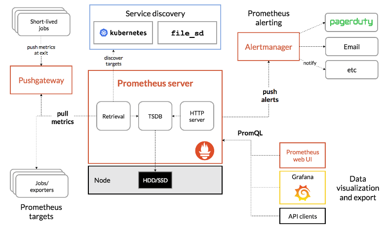

# Objetivos
A ideia desse repositório é manter um estudo de algumas ferramentas de monitoramento e abordar os prinmcipais conceitos que envolve monitoramento e observabilidade, seja para ambiente on-premisses ou focado em [Cloud Native](https://www.cncf.io/). Vou mostrar o uso do Prometheus integrado com outras ferramentas com o Grafana, em ambientes para Kubernetes, infraestrutura local e outros cenários.

# Sumario
- [Objetivos](#objetivos)
- [Sumario](#sumario)
- [Porque monitorar?](#porque-monitorar)
- [Monitoramento x Observabilidade](#monitoramento-x-observabilidade)
  - [Prometheus](#prometheus)
  - [Glossário](#glossário)
  - [Arquitetura](#arquitetura)
  - [Instalação do Prometheus](#instalação-do-prometheus)
    - [Prometheus no Linux](#prometheus-no-linux)

# Porque monitorar?
O monitoramento dentro de tecnologia se refere à iniciativa de obter insights do seu ambiente, seja on-premisses ou cloud native. É o método de ler e entender o que está se passando dentro do contexto da sua infraestrutura/sistema da sua empresa. Existem MUITAS vantagens em manter um monitoramento dos seus ativos de TI, seja servidores, banco de dados, discos, sistemas de backup, aplicações, algumas eu cito abaixo:

- visibilidade da sua infraestrutura e dos sistemas envolvidos
- capacidade de fácil interpretação e leitura dos dados de aplicações
- entendimento fim a fim do que está ocorrendo e o que ocorreu no passado
- centralização lógica de logs e métricas dos sistemas e aplicações
- alarmes, alertas e notificações que podem demonstrar o que está ocorrendo
- uso de ferramentas poderosas suportadas pela comunidade, CNCF, Linux Foundation
- logs, métricas e ações em tempo real, com mínimos detalhes e porcentagens

# Monitoramento x Observabilidade
Aqui existem muitos pontos que é bom destacar, muitas pessoas ainda não tem a ideia da diferença entre as duas abordagens. Vamos começar citando o monitoramento, que é a base da observabilidade. As primeiras ferramentas de monitoramento lá atrás, `Nagios`, `Zabbix` e outras, tinham como foco o monitoramento mais raíz, ou seja, monitorar os principais `recursos de um servidor`, analisar se o `ping está down`, `gerar triggers de uso de disco`, `memória dos servidores`, analisar aquele switch, se  porta n está funcionando bem, se existe `mais portas livres e VLANS disponíveis` para aquele SD e muitos outros cenários. Isso é o monitoramento mais a baixo nível (que não deixa de ser importante, que isso fique claro).

Quando estamos mencionando a observabilidade, o foco muda totalmente. `Medir e garantir` são as palavras mais usadas, medir da forma correta os níveis de serviços e garantir que as aplicações e métricas estejam dentro do esperado, sem delays, atrasos, inconsistências. Aqui dentro do observabilidade, você precisa ir além para medir e observar, você precisa `codar se necessário`, criar um método que cobre todo o cenário de um serviço por exemplo, `integrar com outros sistemas de logs`. Ultimamente tem se usado MUITO a abordagem de `observability as code`, para observar usando código, abordagens baseadas em `IaC`, `GitOps` fazem parte do contexto de observabilidade.

## Prometheus
[Prometheus](https://prometheus.io/) é mais uma de tantas ferramentas existentes no mercado com foco em monitoramento e observabilidade de aplicações, serviços e infraestrutura. Mas ele se difere de MUITAS outras pelo fato de ser bem desenvolvido e receber centenas de milhares de contribuições da comunidade, é um projeto graduado da CNCF.

## Glossário
[Aqui](https://prometheus.io/docs/introduction/glossary/) você encontra termos que são usados dentro da arquitetura do Prometheus, ajuda demais no entendimento da ferramenta e seu modo de funcionamento.

## Arquitetura
Abaixo o exemplo de arquitetura que é usado no Prometheus e seus componentes, o desenho ajuda a esclarecer como e onde estão os componentes e com quais controladores eles se conectam.

## Instalação do Prometheus 
Iremos abordar aqui algumas formas de instalar o Prometheus em diversos tipos de sistemas, seja diretamente no Linux, Docker, Kubernetes, via Helm e mais.

### Prometheus no Linux
Para que possamos ter uma ideia de como podemos partir com o Prometheus, vamos começar do zero com Linux, acho uma forma bem legal de demonstrar o seu uso.

